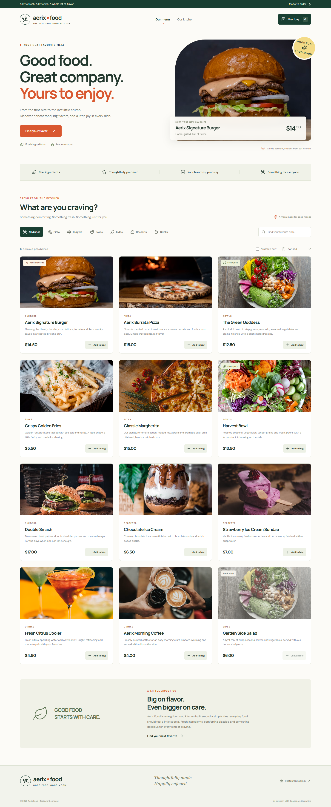
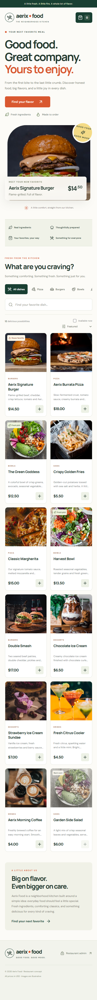

# Aerix Food — Online Food Ordering System

Aerix Food is a complete online ordering system built with Spring Boot, MongoDB Atlas, and React. Its demo menu includes burgers, pizza, ice cream, cold drinks, and morning coffee. Customers can browse, search, filter, view individual dishes, add items to a bag, and review the total. Administrators can sign in and add, update, or delete food.

## Quick start

This repository contains the source code and screenshots. It does not include this computer's private Atlas settings, installed JDK, Node modules, or compiled JAR.

## Run it

1. Open the `backend` folder in IntelliJ as a Maven project.
2. Set both the Project SDK and Maven runner to **JDK 21**.
3. Create `backend/.local/application.properties` from `backend/.env.example`, replace the Atlas URI and admin password with your own private values, and allow your IP in Atlas Network Access. Run `com.basilandember.AerixFoodApplication` (port 8082).
4. Open the `frontend` folder in VS Code.
5. Install Node.js 22 or newer. In the `frontend` terminal run `npm ci`, then `npm run dev`.
6. Visit **http://127.0.0.1:5173**.

The React development server forwards `/api` to the Spring backend. Backend checks use `mvn test`; frontend checks use `npm test` and `npm run build`.

## Atlas and administrator

On the original developer computer only, the private file `backend/.local/application.properties` connects to Atlas Cluster0, database `myDatabase`, collection `foods`. It is excluded from this ZIP and from Git. On another computer, the instructor needs a MongoDB Atlas URI, an allowed IP, and a private admin password. Do not upload or send the original credentials.

For another computer, copy `backend/.env.example` to `backend/.local/application.properties` and replace the placeholders. Allow the computer's IP in Atlas **Network Access**. If the private configuration is missing, the backend cannot connect to Atlas. The first successful start adds 12 starter dishes only when the `foods` collection is empty. Later admin changes persist in Atlas.

If Atlas DNS fails, reconnect the internet/VPN or use a working DNS connection, then restart the backend. Menu requests return an error until Atlas reconnects; the app never pretends that an offline change was saved. `/api/health` returns 200 only when Atlas responds.

## REST API

| Method | Endpoint | Purpose |
| --- | --- | --- |
| GET | `/api/foods` | List/search/filter food |
| GET | `/api/foods/{id}` | View one food |
| POST | `/api/foods` | Add food (admin) |
| PUT | `/api/foods/{id}` | Update food (admin) |
| DELETE | `/api/foods/{id}` | Delete food (admin) |
| POST | `/api/cart/quote` | Recheck prices and calculate total |
| GET | `/api/admin/session` | Verify admin sign-in |
| GET | `/api/health` | Check Atlas connection |

Food fields are ID, name, description, category, price, image URL, and availability. The bag is saved in the browser. **Review order** creates a price summary; it does not take payment.

## Common errors

- A missing Java executable means IntelliJ still points to an old JDK path. Select the installed JDK 21.
- A Maven Central timeout is an internet/DNS problem. Reconnect, then reload Maven.
- An Atlas SRV or shard lookup error is a DNS/VPN problem. Reconnect and restart Spring Boot.
- An Atlas authentication/access error means the database user, password, IP allowlist, or cluster status needs checking.

Images are illustrative Unsplash photos and prices are in USD.

